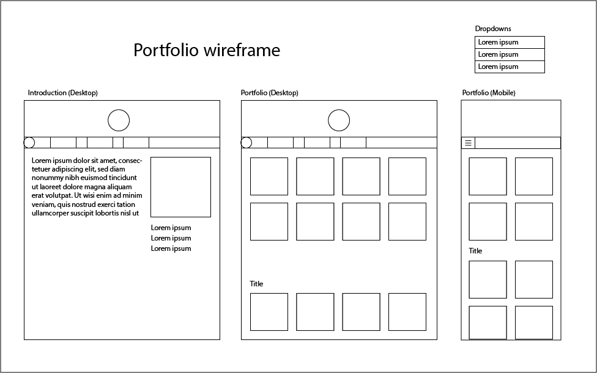
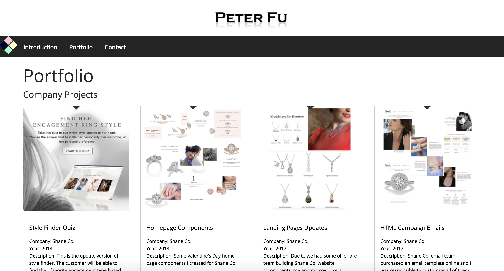
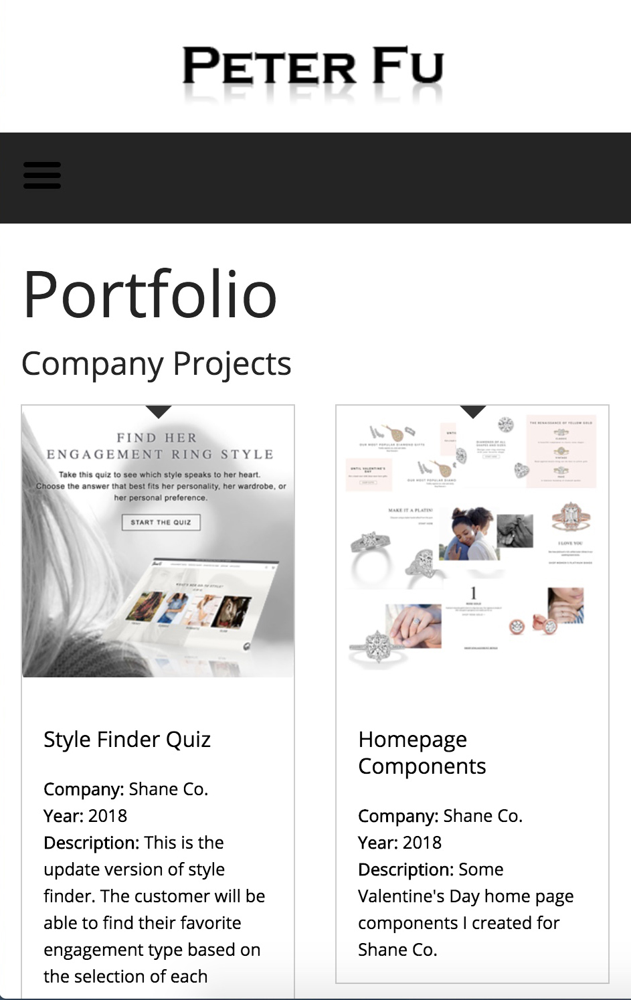

# Peter Fu Portfolio

## Setup:
1. git clone https://github.com/peterfuwork/gulp-project
2. npm install
3. npm start (checkout localhost:8000)

## Description:
This is Peter Fu's first npm gulp portfolio. Please go visit http://chiaen.fu.surge.sh/ to see my website online.

## Wireframe

## Preview

